# SO(a)P Score

This document describes the SO(a)P syntax used to generate the scores and metronomes. The general idea of the syntax is to be able to define and describe the structure of a score in a simple way.

The syntax has been defined as a tradeoff between:
- readability & simplicity of writing.
- express things in a syntax that is as close as possible of a score.

### Example

```
BAR 1 [3+2+2/8] TEMPO [3/8]=60
BAR 2 [3+2+2/8] TEMPO [3/8]=60 curve 2
BAR 4 [2+3+2/8] TEMPO [3/8]=120
```

## Syntax

<!-- toc -->

- [Basics](#basics)
- [Changing signatures and tempi](#changing-signatures-and-tempi)
- [Bars with absolute duration](#bars-with-absolute-duration)
- [Labels](#labels)
- [Sub-division of a bar](#sub-division-of-a-bar)
- [Fermata](#fermata)
- [Additive signatures](#additive-signatures)
- [Tempo curves](#tempo-curves)
- [Tempo equivalences](#tempo-equivalences)
- [Misc & Special cases](#misc--special-cases)
- [Special characters & shortcuts](#special-characters--shortcuts)

<!-- tocstop -->

### Basics

The main unit of a score is a "bar" that is expressed by a bar number, a key signature and a tempo, itself defined as the combination of a unit (e.g. a quarter-note) and a BPM.

The `BAR` keyword _MUST_ always be followed by a bar number, e.g. `BAR 32`.
A signature is expressed between square brackets, e.g. `[4/4]`.
The `TEMPO` keyword is followed by the definition of the unit and the BPM, e.g. `TEMPO [1/4]=60`.

Hence, we can define a metronome with a bar of four beats, and a tempo defined by a quarter-note that equals to 60 bpm, as the following:

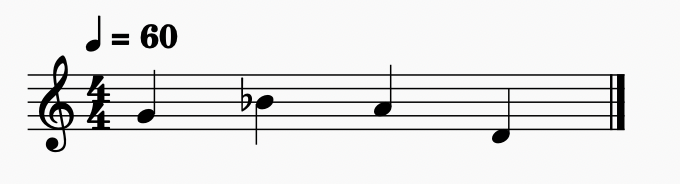

Which corresponds to the SO(a)P syntax:

```
BAR 1 [4/4] TEMPO [1/4]=60
```

It's also possible to define a bar with compound beats, such as a  `[6/8]` signature with a tempo of 60 for a dotted quarter note:

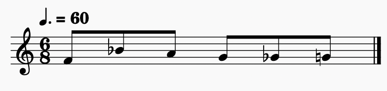

```
BAR 1 [6/8] TEMPO [3/4]=60
```

### Changing signatures and tempi

It is possible to change the signature without chaging the tempo:

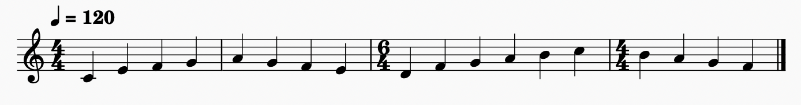

```
BAR 1 [4/4] TEMPO [1/4]=120
BAR 3 [6/4]
BAR 4 [4/4]
```

Or at contrary to change the tempo without modifying the signature:

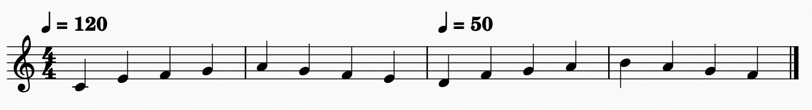

```
BAR 1 [4/4] TEMPO [1/4]=120
BAR 3 TEMPO [1/4]=50
```

### Bars with absolute duration

You can declare bar without absolute duration too, in such cases the bar are considered to contain only one beat:

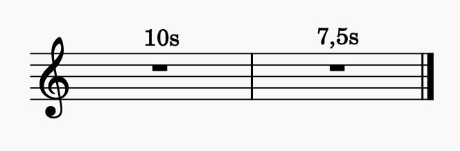

```
BAR 1 10s
BAR 2 7.5s
```

It is also possible to mix absolute duration bars with traditionnal ones:

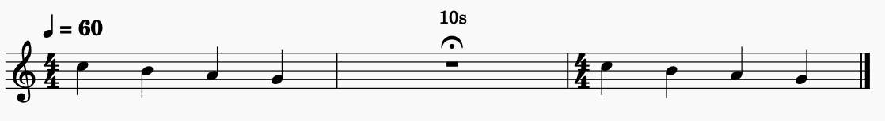

```
BAR 1 [4/4] TEMPO [1/4]=80
BAR 2 10s
BAR 3 [3/4]
```

In the last case, the tempo defined in bar 1 is suspended in bar 2 and applied again in bar 3.

In such bars, only the beginning of the bar is sonified by the metronome and a visual progress bar is displayed.

### Labels

A Label can be declared to add some informations about the bar. The label must be written between double quotes:

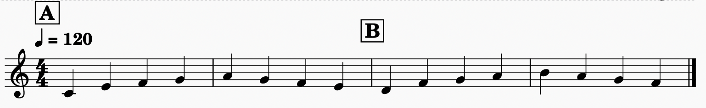


```
BAR 1 [4/4] TEMPO [1/4]=120 "section A"
BAR 3 "section B"
```

### Sub-division of a bar

Pour define events within a bar, we can use the "|" symbol followed by the beat number, e.g.:

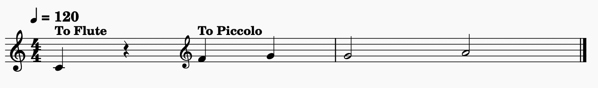

```
BAR 1 [4/4] TEMPO [1/4]=120 "To Flute"
|3 "To Piccolo"
```

This subdivisions can also be a floating point number:

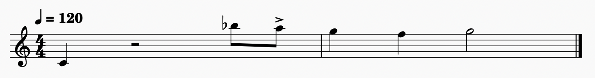

```
BAR 1 [4/4] TEMPO [1/4]=120
|4.5 "accent"
```

_**TIPS**_

To facilitate the reading and the writing of a score, the first beat of a bar is implicitely defined by the `|` symbol. For example:

```
BAR 1 [4/4] TEMPO [1/4]=120
```

is equivalent to:

```
BAR 1 [4/4]
|1 TEMPO [1/4]=120
```

and to:

```
BAR 1 [4/4]
| TEMPO [1/4]=120
```

It is also possible to declare several informations on the same beat on one or several lines. For example:

```
BAR 1 [4/4] TEMPO [1/4]=120 "début du morceau"
```

is equivalent to:

```
BAR 1 [4/4]
| TEMPO [1/4]=120 "début du morceau"
```

and to:

```
BAR 1 [4/4]
| TEMPO [1/4]=120
| "début du morceau"
```


### Fermata

Fermata is a pause in the flow of time, which is defined according to the value of the note or silence and:
- an absolute duration (in hours, minutes, seconds and/or milliseconds), e.g. `2m30s`
- a relative duration, e.g. `2*`
- @todo: a user action, using the `?` symbol

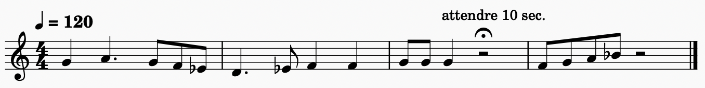

```
BAR 1 [4/4] TEMPO [1/4]=120
BAR 3
|3 FERMATA [1/2]=10s
```

The fermata is here assigned to the half-rest and will stop the flow of time for 10 seconds.

In the following example, the fermata is declared relatively to the duration of the associated note or rest:

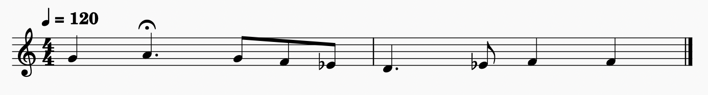

```
BAR 1 [4/4]
|1 TEMPO [1/4]=120
|2 FERMATA [3/8]=2*
```

Here the dotted quarter note will stop the flow of time for the duration of a dotted half note.

Hence, we can use the 3 alternatives syntaxes for the following example:

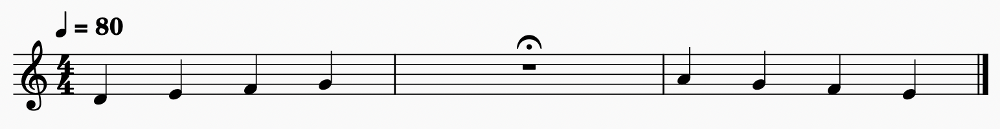

```
// syntax with user action (to be implemented)
BAR 1 [4/4] TEMPO [1/4]=60
BAR 2 FERMATA [1/1]=?
```

```
// syntax with absolute duration
BAR 1 [4/4] TEMPO [1/4]=60
BAR 2 FERMETA [1/1]=10s
```

```
// syntax with relative duration
BAR 1 [4/4] TEMPO [1/4]=60
BAR 2 FERMETA [1/1]=2*
```

_**WARNING**_

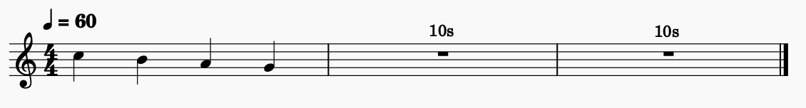

```
BAR 1 [4/4] TEMPO [1/4]=60
BAR 2 10s
```

is not equivalent to:


```
BAR 1 [4/4] TEMPO [1/4]=60
BAR 2 FERMATA [1/1]=10s
```

In the first example, the third bar will continue to be an absolute duration mesure and there wont be any additionnal sonification except on the beginning the the bar.

In the second example, the third bar will go back to the `[4/4/]` defined in bar 1, and 2 beats will be sonified before the third bar, to help restarting at the right time.

### Additive signatures

It is possible to define bar with additive signatures:

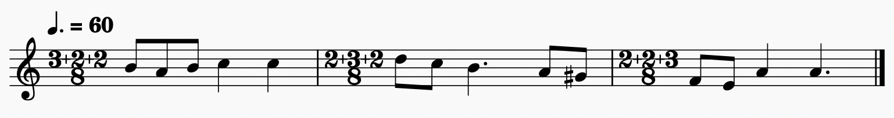


```
BAR 1 [3+2+2/8] TEMPO [3/8]=60 
BAR 2 [2+3+2/8]
BAR 3 [2+2+3/8]
```

### Tempo curves

It is possible to write tempo curves using the SO(a)P syntax:

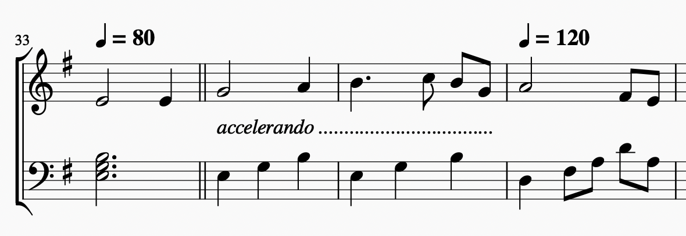

```
BAR 33 [4/4] TEMPO [1/4]=80 
BAR 34 TEMPO [1/4]=80 curve 1.5
BAR 36 TEMPO [1/4]=120
```

The tempo curve ends at the next `TEMPO` definition.

The `curve` keyword defines the exponential constant of the tempo curve:


with


Note that this is possible to change the signature of bar that are inside a tempo curve:

```
BAR 1 [3+2+2/8] TEMPO [3/8]=60
BAR 2 TEMPO [3/8]=60 curve 2
BAR 3 [2+3+2/8]
BAR 4 [2+3+2/8] TEMPO [3/8]=120
```

### Tempo equivalences

It is also possible to define a tempo according to the previous tempo and new metric. The notation follows the convention: `new unit = old unit`, for example:

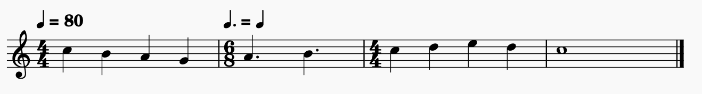

```
BAR 1 [4/4] TEMPO [1/4]=80
BAR 2 [6/8] TEMPO [3/8]=[1/4]
BAR 3 [4/4]
```

### End of score

You can define the end of a score by using the `END` keyword.
This will prevent the metronome the continue forever, and will stop it at the end of the given `BAR`. For example:

```
BAR 1 [4/4] TEMPO [1/4]=120
BAR 10 END
```

The example above will play until the last beat of the bar 10 and automatically stop at this point.

_**IMPORTANT**_

To export your score in the `asco` format or as a `.wav` file, the `END` keyword is *mandatory*.

### Misc & Special cases

Comment can be add comment to the score with `//` syntax, everything following these 2 characters will be ignored:

```
// this line is ignored
BAR 1 [4/4] TEMPO [1/4]=60
// blank lines are ignored

BAR 3 "section 2" // this will be ignored too
```

The first definition of a `BAR` in musical time must define a signature AND and tempo, e.g.:

```
BAR 1 [4/4] TEMPO [1/4]=60 // is valid
BAR 1 [4/4] // is invalid
```

A tempo definition MUST be associated to a full beat, e.g.

```
BAR 1 [4/4] TEMPO [1/4]=60 
BAR 2 
|1 TEMPO [1/4]=90
|3 TEMPO [1/4]=60  
```

Labels and tempo definitions can be written in any order, e.g.:

```
BAR 3 TEMPO [1/4]=120 "section A" 
```

is equivalent to:

```
BAR 3 "section A" TEMPO [1/4]=120 
```

### Special characters & shortcuts

The special characters used by the syntax can be written with the following shortcuts on a Mac:
- `[` character is written with `Option+Shift+(`
- `]` character is written with `Option+Shift+)`
- `|` character is written with `Option+Shift+L`


